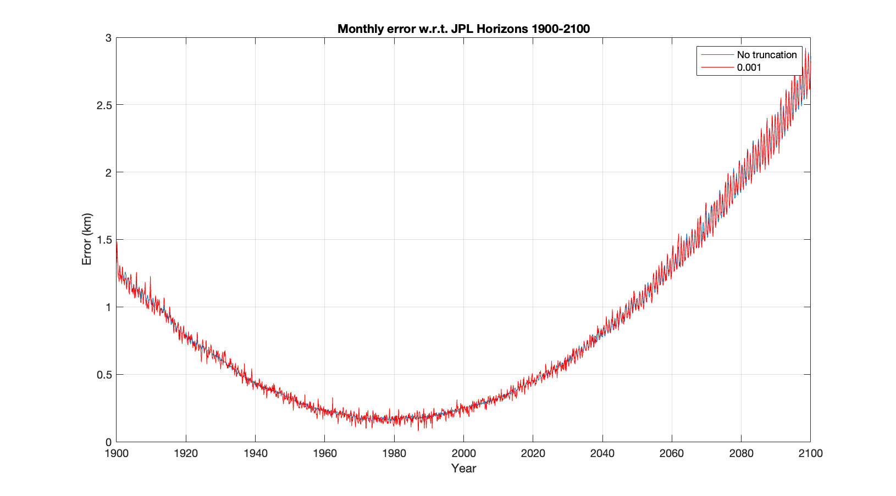
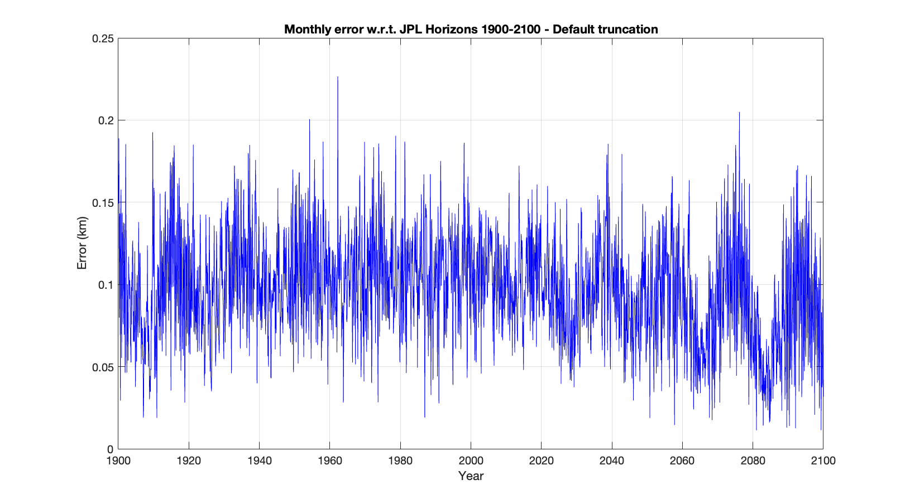

# ELP2000-82B
A self-contained JavaScript implementation of the lunar solution ELP2000-82B developed by Jean Chapront, Michelle Chapront-Touzé, and others at the Bureau des Longitudes, France.

The code computes the coordinates of the Moon in the geocentric ecliptic frame of mean ecliptic and equinox of J2000 as described in document [elp82b.pdf](elp82b.pdf) and the related publications:
1. Chapront J., Chapront-Touz ́e, M.: 1982, Planetary perturbations of the Moon in ELP-2000. Proceeding of the Conference on Analytical Methods and Ephemerides (Namur, Belgium), Celes. Mech., 26, 83
2. Chapront-Touz ́e, M.: 1982, The ELP solution of the main problem of the Moon and some applications. Proceeding of the Conference on Analytical Methods and Ephemerides (Namur, Belgium), Celes. Mech., 26, 63
3. Chapront J., Chapront-Touz ́e, M.: 1982, Comparison of ELP 2000-82 to a JPL numerical integration, in High precision Earth rotation and Earth-Moon dynamics, O. Calame ed., D. Reidel Publ. Co., p.257
4. Chapront-Touz ́e, M.: 1983, Perturbations due to the shape of the Moon in the lunar theory ELP 2000, Astron. Astrophys., 119, 256
5. Chapront-Touz ́e, M., Chapront J.: 1983, The lunar Ephemeris ELP 2000, Astron. Astrophys., 124, 50
6. Chapront-Touz ́e, M., Chapront J.: 1988, ELP 2000-85: a semi-analytical lunar ephemeris adequate for historial times, Astron. Astrophys., 190, 342
7. J. Chapront, M. Chapront-Touze, G.Francou: 2002, A new determination of lunar orbital parameters, precession constant and tidal acceleration from LLR measurements Astronomy Astrophysics.

The code has been also integrated into the larger library [orbits.js](https://github.com/vsr83/orbits.js).

The code is generally used as follows [(run)](https://vsr83.github.io/ELP2000-82B/dist/index.html):
```
<!DOCTYPE html>
<html>
    <head>
        <script src="./elp2000-82b.js"></script>
    </head>
    <body>
        <script>
            // 2030-01-01 00:00:00 Barycentric Dynamical Time (TDB)
            const julianTimeTdb = 2462502.500000000;
            alert(elp2000_82b.elp2000CartesianJ2000(julianTimeTdb));
        </script>
    </body>
</html>
```

The ELP2000-82B data is stored in data/ELP2000-82b.json JSON file. The ELP2000 data used for the generation of the JSON file is downloaded with the script [data/download_elp2000.js](data/download_elp2000.js). Then, the JSON file is generated with the script [data/create_json_elp2000.js](data/create_json_elp2000.js). 

Since it is often not necessary or feasible to compute the entire series, the truncation level of the series data can be adjusted with the two parameters given to the script create_json_elp2000.js. No arguments corresponds to the full series. Both steps with the truncation level of 0.001 used by default can be executed by running "npm run elp2000". 

The dist folder contains two versions of the library:
* elp2000-82b.js built with default truncation (376 kb),
* elp2000-82b_full.js without truncation (4.4 Mb).

The accuracy of the data has been tested by comparison to [JPL Horizons](https://ssd.jpl.nasa.gov/horizons/app.html#/) and the original reference implementation available at [http://cdsarc.u-strasbg.fr/viz-bin/ftp-index?/ftp/pub/ftp/ftp/ftp/catv/6/79/example.f](http://cdsarc.u-strasbg.fr/viz-bin/ftp-index?/ftp/pub/ftp/ftp/ftp/catv/6/79/example.f). The comparisons are performed by the test script [test/test.js](test/test.js). 

Without truncation, the coordinates from the reference implementation were evaluated by computation of the coordinates of the Moon at the start of each month in the range 1900-2100. Before the corrections from [7] were applied, the maximum and average errors are 12.5 cm and 3.05 cm, respectively. With the default truncation of 0.001, the maximum and average errors were 136.6 m and 9.23 m, respectively.

The comparison has been repeated w.r.t. data from JPL Horizons with the results depicted below:


In addition, a separate comparison has been performed by computation of the coordinates at the start of each hour in 2020. The observed error varies between 70 and 128 meters.